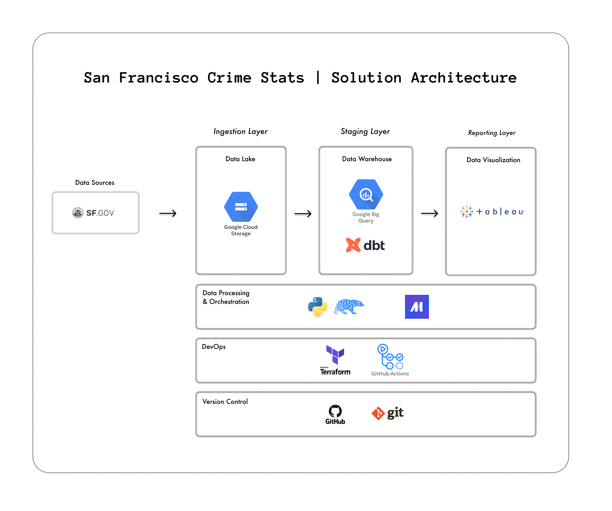

**Table of Contents**
- [1. Overview](#1-overview)
  - [1.1. Problem Statement](#11-problem-statement)
  - [1.2. Purpose](#12-purpose)
  - [1.3. Data Sources](#13-data-sources)
- [2. Design \& Development](#2-design--development)
  - [2.1. Solution Architecture](#21-solution-architecture)
  - [2.2. Tech Stack](#22-tech-stack)
  - [2.3. Data Model](#23-data-model)
  - [2.4. Orchestration](#24-orchestration)
  - [2.5. Dashboard](#25-dashboard)
- [3. Challenges](#3-challenges)
- [4. Deployment](#4-deployment)
- [5. Future Enhancements](#5-future-enhancements)
- [6. Project Structure](#6-project-structure)
- [7. References](#7-references)
- [8. Acknowledgements](#8-acknowledgements)

 

# 1. Overview

## 1.1. Problem Statement
San Francisco is a vibrant and diverse city, but like any major urban area, it faces ongoing challenges related to public safety and crime. In recent years, it has become the center of attention due to its homelessness and drug problem which has been widely covered in the mainstream media. For someone planning to move to the city, this can be intimdating and even frightening.  

## 1.2. Purpose
The San Francisco Crime Stats data pipeline and dashboard addresses this problem by ingesting, transforming, and visualizing the San Francisco Police Department's (SFPD) incident reports data set. 
The SFPD publishes detailed, regularly updated incident data through the city's open data portal (DataSF). This empowers a prospective resident to dig into the data and make an informed decision for themselves on if the problems related to public safety are understated or overexaggerated by the media.

## 1.3. Data Sources
- [DataSF API - Police Department Incident Reports: 2018 to Present
](https://data.sfgov.org/Public-Safety/Police-Department-Incident-Reports-2018-to-Present/wg3w-h783/about_data)

 

# 2. Design & Development
## 2.1. Solution Architecture

 

## 2.2. Tech Stack
- **Storage:** GCP Buckets, Parquet
- **Data Processing:** BigQuery, Python, Polars, dbt Core
- **Data Visualization:** Preset Cloud/Superset 
- **Orchestration:** Mage AI
- **DevOps:** Terraform, Docker, GitHub, GitHub Actions

## 2.3. Data Model

## 2.4. Orchestration

## 2.5. Dashboard

# 3. Challenges

 

# 4. Deployment

 

# 5. Future Enhancements

 

# 6. Project Structure

 

# 7. References

# 8. Acknowledgements