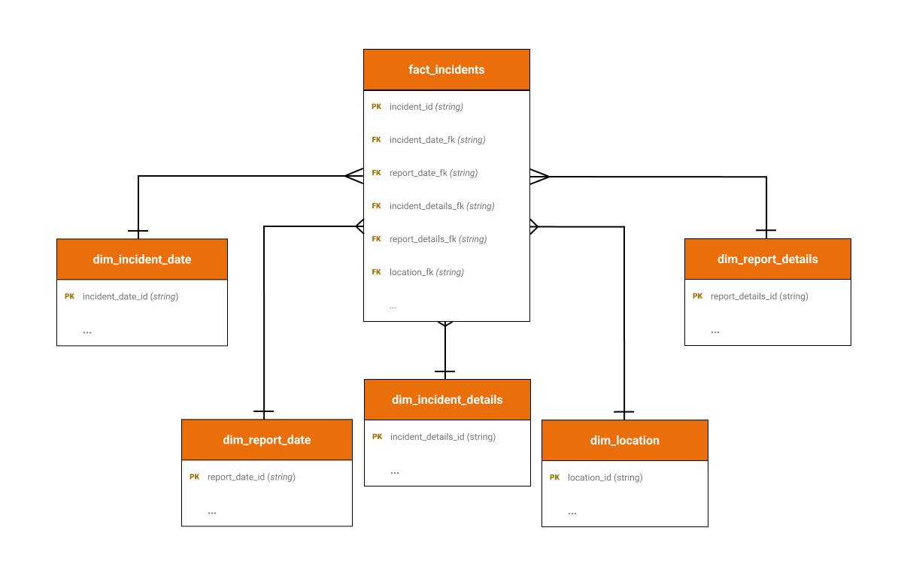

**Table of Contents**
- [1. Overview](#1-overview)
  - [1.1. Problem Statement](#11-problem-statement)
  - [1.2. Purpose](#12-purpose)
  - [1.3. Data Sources](#13-data-sources)
- [2. Design \& Development](#2-design--development)
  - [2.1. Solution Architecture](#21-solution-architecture)
  - [2.2. Tech Stack](#22-tech-stack)
  - [2.3. Data Model - Star Schema](#23-data-model---star-schema)
  - [2.4. dbt Data Lineage](#24-dbt-data-lineage)
  - [2.5. Orchestration](#25-orchestration)
- [3. Challenges](#3-challenges)
- [4. Deployment](#4-deployment)
- [5. Future Enhancements](#5-future-enhancements)
- [6. Project Structure](#6-project-structure)
- [7. References](#7-references)
- [8. Acknowledgements](#8-acknowledgements)

<br>

# 1. Overview

## 1.1. Problem Statement
San Francisco is a vibrant and diverse city, but like any major urban area, it faces ongoing challenges related to public safety and crime. In recent years, it has become the center of attention due to its homelessness and drug problem which has been widely covered in the mainstream media. For someone planning to move to the city, this can be intimdating and even frightening.  

## 1.2. Purpose
The San Francisco Crime Stats data pipeline and dashboard addresses this problem by ingesting, transforming, and visualizing the San Francisco Police Department's (SFPD) incident reports data set. 
The SFPD publishes detailed, regularly updated incident data through the city's open data portal (DataSF). This empowers a prospective resident to dig into the data and make an informed decision for themselves on if the problems related to public safety are understated or overexaggerated by the media.


## 1.3. Data Sources
- [DataSF API - Police Department Incident Reports: 2018 to Present
](https://data.sfgov.org/Public-Safety/Police-Department-Incident-Reports-2018-to-Present/wg3w-h783/about_data)

<br>

# 2. Design & Development
## 2.1. Solution Architecture


## 2.2. Tech Stack
- **Storage:** GCP Buckets, Parquet
- **Data Processing:** BigQuery, Python, Polars, dbt Core
- **Data Visualization:** [Preset Cloud/Superset](https://preset.io/)
- **Orchestration:** [Mage AI](https://www.mage.ai/)
- **DevOps:** Terraform, Docker, GitHub, GitHub Actions

## 2.3. Data Model - Star Schema 



## 2.4. dbt Data Lineage


## 2.5. Orchestration


### "*ingest_sfpt_incidents_daily*" Pipeline


### "*etl_gcs_to_bigquery*" Pipeline


### "*build_dbt_all_models*" Pipeline


## 2.6. Dashboard


https://github.com/user-attachments/assets/c7ad1234-581b-480f-a036-0c82e82a06ff

<br>

# 3. Challenges
1. **Terraform Deployment Permissions:** It was difficult identifying the correct roles that were required by the service account to create all infrastructure and deploy the docker image to Cloud Run seamlessly. This was only partially defined in the mage-ai documentation and required extensive troubleshooting to resolve missing roles.


# 4. Deployment
- All infrastructure is deployed via Terraform scripts
- A custom docker mage-ai docker image is pulled from Docker Hub and deployed to GCP Cloud Run via Terraform scripts
    - Docker image: [kdayno/sf-crime-stats](https://hub.docker.com/r/kdayno/sf-crime-stats)
  
# 5. Future Enhancements
1. **Additional Data Sources:** The open data portal (DataSF) offers many other datasets which could be used to provide deeper analysis. For example, the [Registered Business Locations - San Francisco](https://data.sfgov.org/Economy-and-Community/Registered-Business-Locations-San-Francisco/g8m3-pdis/about_data) dataset could be integrated into the solution to analyze how crime has impacted businesses in the city over time.

# 6. Project Structure
```
sf-crime-stats
|
├── docs
│   ├── deployment                 
│   └── images                     -> Images for README
├── .github
│   └── workflows                  -> GitHub Actions
├── Dockerfile                     -> Builds custom docker mage-ai image for GCP deployment
├── docker-compose.yml             -> Used for local development
├── README.md
├── mage
│   └── sf-crime-stats-mage       -> Mage project
│       ├── data_exporters
│       ├── data_loaders
│       ├── dbts
│       ├── markdowns
│       ├── pipelines
│       └── transformers
├── dbt
│   └── sf_crime_stats.            -> dbt project
│       ├── dbt_project.yml
│       ├── macros
│       └── models
│           ├── core
│           ├── marts
│           └── staging
└── terraform                      -> Terraform project
    ├── envs
    │   ├── dev
    │   │   ├── keys
    │   │   ├── main.tf
    │   │   ├── terraform.tfvars
    │   │   └── variables.tf
    │   └── prod
    │       ├── keys
    │       ├── main.tf
    │       ├── terraform.tfvars
    │       └── variables.tf
    └── modules
        ├── dbtcloud
        │   ├── main.tf
        │   └── variables.tf
        └── gcp
            ├── db.tf
            ├── fs.tf
            ├── load_balancer.tf
            ├── main.tf
            └── variables.tf
```

# 7. References
Mage AI Docs:
- [Deploy to GCP with Terraform](https://docs.mage.ai/production/deploying-to-cloud/gcp/setup#4-deploy)
- [GCP Secret Management](https://docs.mage.ai/production/deploying-to-cloud/secrets/GCP)

Preset BI Docs:
- [Configuring Dashboard Refresh](https://docs.preset.io/docs/creating-a-dashboard#edit-dashboard-properties)

# 8. Acknowledgements
This project was built as the capstone for the [Data Engineering Zoomcamp](https://github.com/DataTalksClub/data-engineering-zoomcamp) - 2024 Cohort.
